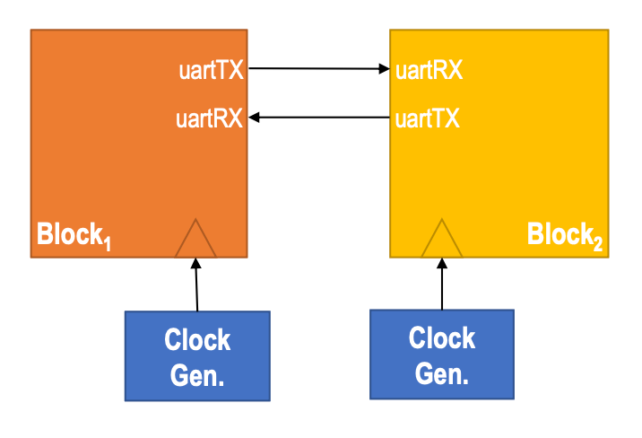

This series of articles for this project is intended to record the theories, steps, and errors involved in the project.

# Theory

## UART

(Universal Asynchronous Receiver/Transmitter) UART is a point-to-point asynchronous serial communication protocol that allows the transmitter and receiver to communicate with each other.

1. UART does not have a shared clock; the transmitter and receiver each have their own independent clocks.

2. The UART transmitter and receiver communicate via only two data lines (RX and TX).

