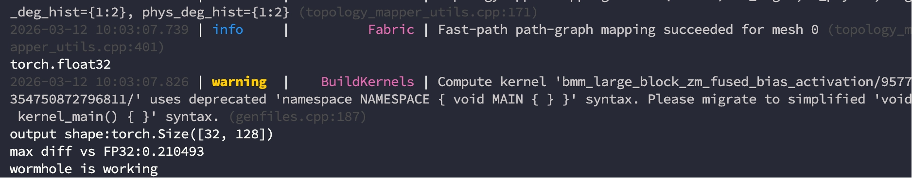
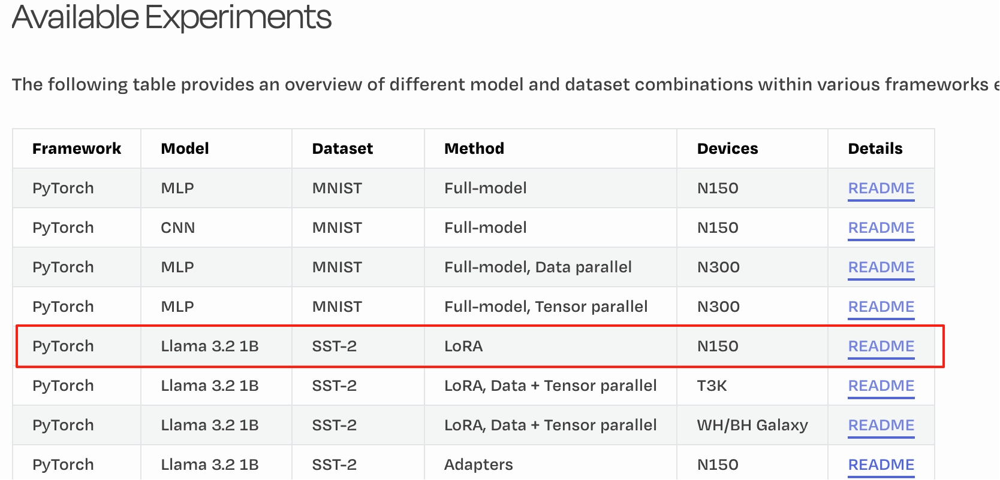
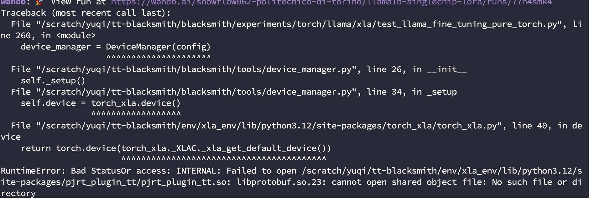
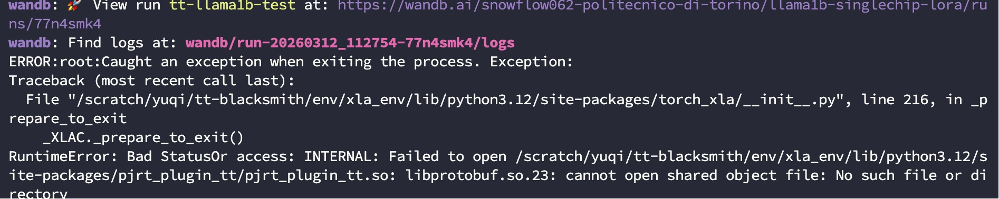
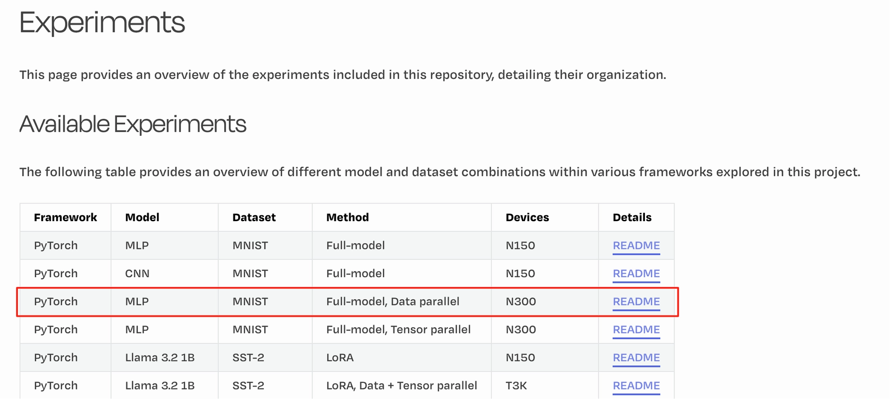
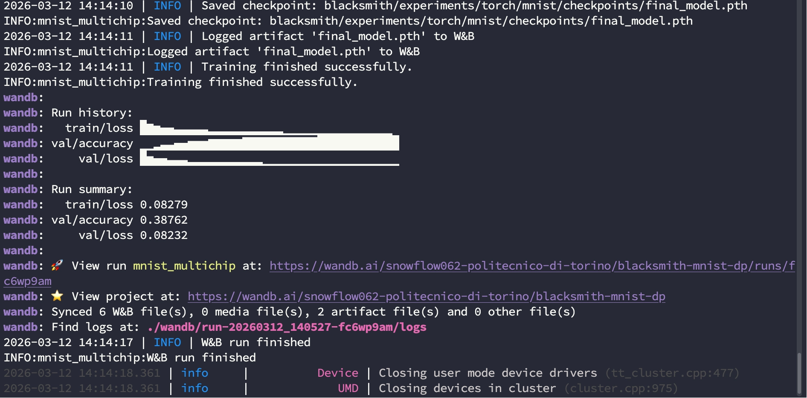

```plain
python3 -m venv myenv
source myenv/bin/activate
pip install ttnn
pip install torch

```

I try to use a simple test program.

```plain
python3 -c "
import torch
import ttnn
# only use single chip
device =ttnn.open_device(device_id=0)

a=torch.randn(32,64) #random matrix in cpu ram
b=torch.randn(64,128)

print(a.dtype)

#move from cpu ram to wormhole dram
tt_a=ttnn.from_torch(a, dtype=ttnn.bfloat16,layout=ttnn.TILE_LAYOUT, device=device)
tt_b=ttnn.from_torch(b, dtype=ttnn.bfloat16, layout=ttnn.TILE_LAYOUT, device=device)

#making matmul operation in wormhole
tt_c=ttnn.matmul(tt_a,tt_b)
#move from wormhole dram to cpu ram.
result = ttnn.to_torch(tt_c)
#cpu computation, it's the golden result(fp32，default datatype)
expected =a @ b

diff =(result.float() - expected).abs().max()
print(f'output shape:{result.shape}')
print(f'max diff vs FP32:{diff:.6f}')

ttnn.close_device(device)
print('wormhole is working')
"

```

result:


mask tensixs are different, and the chip 0 directly connects to the host pc by PCIe, and the chip 1 is remote by Ethernet. (`CPU ←── PCIe ──→ Chip 0 ←── Ethernet ──→ Chip 1`)



bfloat16(wormhole) vs float32(cpu):0.210493

When I change the datatype from bfloat16 to float32:

max diff vs FP32:0.011194 k=4 max diff vs FP32:0.032349 k=64 max diff vs FP32:0.057039 k=128

Maybe the order of accumulation affects the result. When k is bigger, the diff is bigger.

# Experiments

Then, follow this documentation: [https://docs.tenstorrent.com/tt-blacksmith/src/getting-started.html](https://docs.tenstorrent.com/tt-blacksmith/src/getting-started.html)

```plain
git clone <https://github.com/tenstorrent/tt-blacksmith.git>
cd tt-blacksmith
source env/activate --xla

```

First, I want to try this experiment on a single chip of n300.

## Llama 3.2 1B Lora failed (solved)



getting access right: [https://huggingface.co/meta-llama/Llama-3.2-1B](https://huggingface.co/meta-llama/Llama-3.2-1B)

```plain
pip install huggingface_hub
huggingface-cli login
# input your huggingface token: Access Tokens 
python3 blacksmith/experiments/torch/llama/xla/test_llama_fine_tuning_pure_torch.py \
  --config blacksmith/experiments/torch/llama/xla/lora/single_chip/test_llama_3_2_1b_sst2.yaml

```


You can create a W&B account.

When I first ran the experiment, it has errors.





libprotobuf.so.23: cannot open shared object file: No such file or directory

```plain
find / -name "libprotobuf.so*" 2>/dev/null
```


it only has so.32 version.

I try to cheat.

```plain
sudo ln -s /usr/lib/x86_64-linux-gnu/libprotobuf.so.32 /usr/lib/x86_64-linux-gnu/libprotobuf.so.23

```

and re-run, get the new error.

> ckernel_sfpu_trigonometry.h: In function 'calculate_cosine':ckernel_sfpu_trigonometry.h:321:1: error: unable to generate reloads for:...during RTL pass: reloadckernel_sfpu_trigonometry.h:321:1: internal compiler error: in curr_insn_transform, at lra-constraints.cc:4355gcc (tenstorrent/sfpi:7.31.0[315]) 15.1.0

```plain
sudo apt-get install libnsl2
```

and re-run, get the new error.

> TT_THROW: trisc1 build failed. internal compiler error: in curr_insn_transform, at [lra-constraints.cc:4355](http://lra-constraints.cc:4355) → ckernel_sfpu_trigonometry.h: In function 'calculate_cosine'

<aside> 💡

The bug is in the SFPI compiler (Tenstorrent's custom GCC fork for RISC-V Tensix cores). The GCC register allocator (LRA) fails to generate register reload code for the custom SFPI instruction `rvtt_sfploadi_int` inside the `calculate_cosine` function.

</aside>

I tried to search in the GitHub issue part of tenstorrent, but not the same issue.

But, the tt-blacksmith staff tested those experiments, the previous version of sfpi should be used. But if we directly change the SFPI version to a lower version, it may produce some conflicts to other tt tools. So I try to lower the `pjrt-plugin-tt` version.

```plain
cat /scratch/yuqi/tt-blacksmith/env/xla_requirements.txt

# outputs
--extra-index-url <https://pypi.eng.aws.tenstorrent.com>
--extra-index-url <https://download.pytorch.org/whl/cpu>
pjrt-plugin-tt==1.0.0.dev20260309001114
torchvision==0.24.1+cpu

```

Then, the output includes `extra-index-url <https://pypi.eng.aws.tenstorrent.com`>

And the current version is `pjrt-plugin-tt==1.0.0.dev20260309001114`

Choosing the version of pjrt-plugin-tt satisfies the Python version and is a previous version.

```plain
pip install pjrt-plugin-tt==0.9.0.dev20260224001247 --extra-index-url <https://pypi.eng.aws.tenstorrent.com> --extra-index-url <https://download.pytorch.org/whl/cpu>
```

Then, re-run the experiment.

```plain
python3 blacksmith/experiments/torch/llama/xla/test_llama_fine_tuning_pure_torch.py --config blacksmith/experiments/torch/llama/xla/lora/single_chip/test_llama_3_2_1b_sst2.yaml
```

Training started successfully.

other error:

Timeout waiting for Ethernet core service

```plain
pip install tt-smi
#reset chip
tt-smi -r 0
```

## MLP MNIST experiment



```plain
source env/activate --xla
#Single Chip - Linear Model
python blacksmith/experiments/torch/mnist/test_mnist_training.py
#Single Chip - CNN Model
python blacksmith/experiments/torch/mnist/cnn/test_mnist_cnn_training.py
#Multichip - data parallel
python blacksmith/experiments/torch/mnist/data_parallel/test_mnist_training.py
#Multichip - tensor parallel
python blacksmith/experiments/torch/mnist/tensor_parallel/test_mnist_training.py
```



This is multichip-data parallel.
