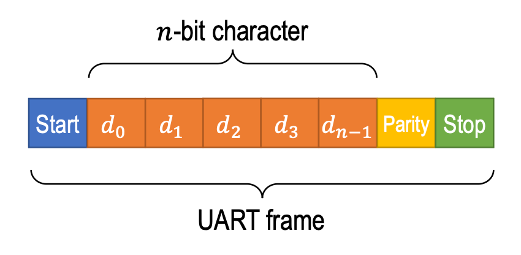
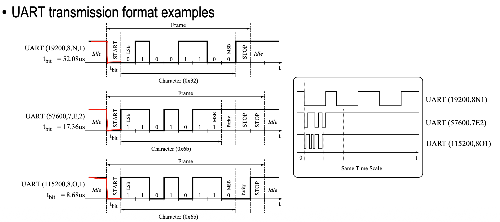

这个项目的系列文章是为了记录项目中涉及到的理论、步骤、以及错误。

# 理论

## UART

UART（universal asynchronous receiver transmitter）是一种点对点异步串行通信协议，让发送端和接收端相互通信。

1、uart没有共享时钟，发送端和接收端各自拥有独立的时钟。

2、uart的发送端和接收端只通过两根数据线（RX和TX）通信

实际上接收端和发送端各自还有一根线是连接GND的，并没有在图上画出来。

因为没有时钟线，两端的独立时钟需要**定时同步**一下，来对齐采样点。两端的时钟理想情况下有相同的频率（提前约定好的波特率），但是由于制造的微小误差，即便双方都设定了115200的波特率，实际上也会有微小的快慢差异。因此，接收端需要一个信号来对齐自己的采样节奏

那么，在RX和TX上传输的数据是什么呢？是数据帧。这个信号就在数据帧中。

一帧包含以下内容：

1、起始位：1位。总线空闲的时候为高电平，当高电平转向低电平，表明一个数据帧的开始。这个起始信号就是同步信号。

