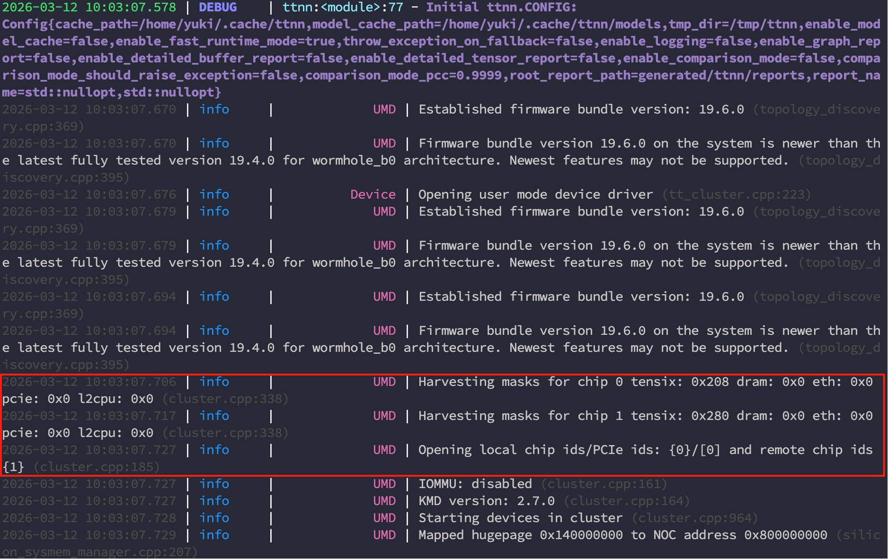
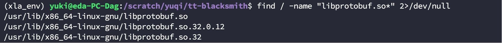

```plain
python3 -m venv myenv
source myenv/bin/activate
pip install ttnn
pip install torch
```

我尝试用一个简单的测试程序。

```plain
python3 -c "
import torch
import ttnn
# only use single chip
device =ttnn.open_device(device_id=0)

a=torch.randn(32,64) #random matrix in cpu ram
b=torch.randn(64,128)

print(a.dtype)

#move from cpu ram to wormhole dram
tt_a=ttnn.from_torch(a, dtype=ttnn.bfloat16,layout=ttnn.TILE_LAYOUT, device=device)
tt_b=ttnn.from_torch(b, dtype=ttnn.bfloat16, layout=ttnn.TILE_LAYOUT, device=device)

#making matmul operation in wormhole
tt_c=ttnn.matmul(tt_a,tt_b)
#move from wormhole dram to cpu ram.
result = ttnn.to_torch(tt_c)
#cpu computation, it's the golden result(fp32，default datatype)
expected =a @ b

diff =(result.float() - expected).abs().max()
print(f'output shape:{result.shape}')
print(f'max diff vs FP32:{diff:.6f}')

ttnn.close_device(device)
print('wormhole is working')
"
```

结果：



mask tensix 是不同的，芯片 0 通过 PCIe 直接连接主机，芯片 1 则通过以太网远程连接。（`CPU ←── PCIe ──→ Chip 0 ←── Ethernet ──→ Chip 1`）


bfloat16（wormhole）vs float32（cpu）：0.210493

当我把数据类型从 bfloat16 改为 float32 时：

max diff vs FP32:0.011194 k=4

max diff vs FP32:0.032349 k=64

max diff vs FP32:0.057039 k=128

也许累加顺序会影响结果。当 k 越大时，误差也越大。

# 实验

接下来，按照这个文档操作：[https://docs.tenstorrent.com/tt-blacksmith/src/getting-started.html](https://docs.tenstorrent.com/tt-blacksmith/src/getting-started.html)

```plain
git clone <https://github.com/tenstorrent/tt-blacksmith.git>
cd tt-blacksmith
source env/activate --xla
```

首先，我想在 n300 的单芯片上尝试这个实验。

## Llama 3.2 1B Lora 失败（已解决）


获取访问权限：[https://huggingface.co/meta-llama/Llama-3.2-1B](https://huggingface.co/meta-llama/Llama-3.2-1B)

```plain
pip install huggingface_hub
huggingface-cli login
# input your huggingface token: Access Tokens
python3 blacksmith/experiments/torch/llama/xla/test_llama_fine_tuning_pure_torch.py \
  --config blacksmith/experiments/torch/llama/xla/lora/single_chip/test_llama_3_2_1b_sst2.yaml
```

你可以创建一个 W&B 账号。

第一次运行实验时，出现了错误。


libprotobuf.so.23: cannot open shared object file: No such file or directory

```plain
find / -name "libprotobuf.so*" 2>/dev/null
```



系统里只有 so.32 版本。

我试着"作弊"一下。

```plain
sudo ln -s /usr/lib/x86_64-linux-gnu/libprotobuf.so.32 /usr/lib/x86_64-linux-gnu/libprotobuf.so.23
```

重新运行，又出现了新的错误。

> RuntimeError: Bad StatusOr access: INTERNAL: Failed to open /scratch/yuqi/tt-blacksmith/env/xla_env/lib/python3.12/site-packages/pjrt_plugin_tt/pjrt_plugin_tt.so: libnsl.so.2: cannot open shared object file: No such file or directory

```plain
sudo apt-get install libnsl2
```

重新运行，又出现了新的错误。

> ckernel_sfpu_trigonometry.h: In function 'calculate_cosine':ckernel_sfpu_trigonometry.h:321:1: error: unable to generate reloads for:...during RTL pass: reloadckernel_sfpu_trigonometry.h:321:1: internal compiler error: in curr_insn_transform, at lra-constraints.cc:4355gcc (tenstorrent/sfpi:7.31.0[315]) 15.1.0

这个 bug 出在 SFPI 编译器（Tenstorrent 为 RISC-V Tensix 核心定制的 GCC 分支）中。GCC 的寄存器分配器（LRA）无法为 `calculate_cosine` 函数中的自定义 SFPI 指令 `rvtt_sfploadi_int` 生成寄存器重载代码。

我在 Tenstorrent 的 GitHub issue 中搜索过，但没有找到相同的问题。

不过，tt-blacksmith 的工作人员测试过这些实验，应该使用之前的 sfpi 版本。但如果直接把 SFPI 降版本，可能会和其他 tt 工具产生冲突。所以我尝试降低 `pjrt-plugin-tt` 的版本。

```plain
cat /scratch/yuqi/tt-blacksmith/env/xla_requirements.txt

# outputs
--extra-index-url <https://pypi.eng.aws.tenstorrent.com>
--extra-index-url <https://download.pytorch.org/whl/cpu>
pjrt-plugin-tt==1.0.0.dev20260309001114
torchvision==0.24.1+cpu
```

输出中包含 `extra-index-url <https://pypi.eng.aws.tenstorrent.com>`

当前版本是 `pjrt-plugin-tt==1.0.0.dev20260309001114`

选择一个满足 Python 版本要求且是之前的 pjrt-plugin-tt 版本。

```plain
pip install pjrt-plugin-tt==0.9.0.dev20260224001247 --extra-index-url <https://pypi.eng.aws.tenstorrent.com> --extra-index-url <https://download.pytorch.org/whl/cpu>
```

然后重新运行实验。

```plain
python3 blacksmith/experiments/torch/llama/xla/test_llama_fine_tuning_pure_torch.py --config blacksmith/experiments/torch/llama/xla/lora/single_chip/test_llama_3_2_1b_sst2.yaml
```

训练成功启动了。

其他错误：

Timeout waiting for Ethernet core service

```plain
pip install tt-smi
#reset chip
tt-smi -r 0
```

## MLP MNIST 实验


```plain
source env/activate --xla
#Single Chip - Linear Model
python blacksmith/experiments/torch/mnist/test_mnist_training.py
#Single Chip - CNN Model
python blacksmith/experiments/torch/mnist/cnn/test_mnist_cnn_training.py
#Multichip - data parallel
python blacksmith/experiments/torch/mnist/data_parallel/test_mnist_training.py
#Multichip - tensor parallel
python blacksmith/experiments/torch/mnist/tensor_parallel/test_mnist_training.py
```


这是多芯片数据并行的结果。
